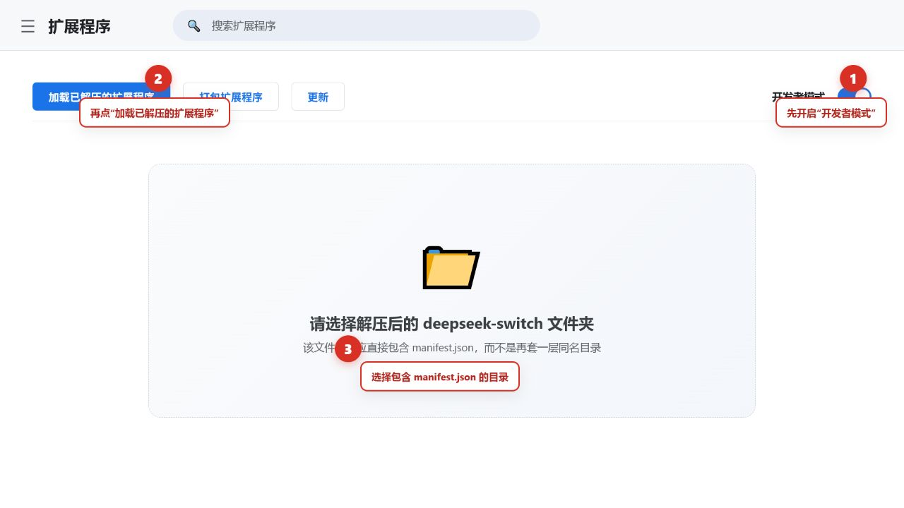
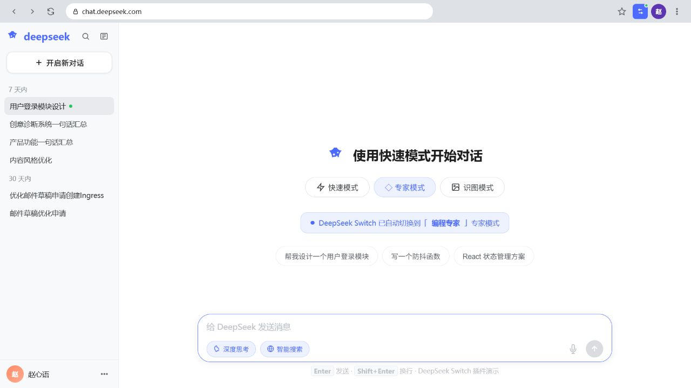
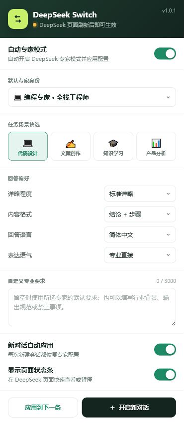
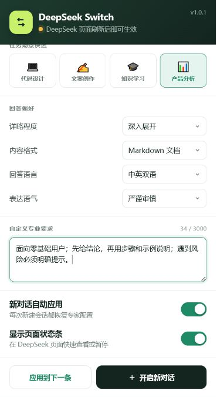
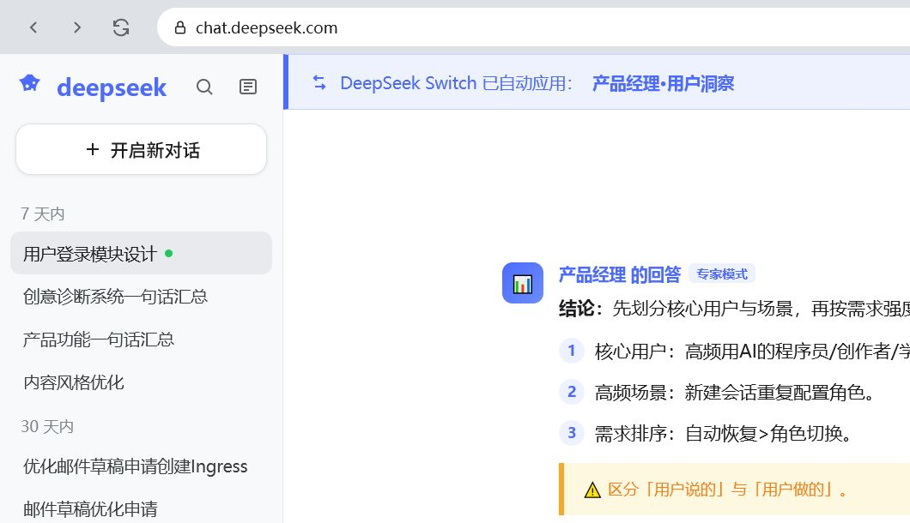
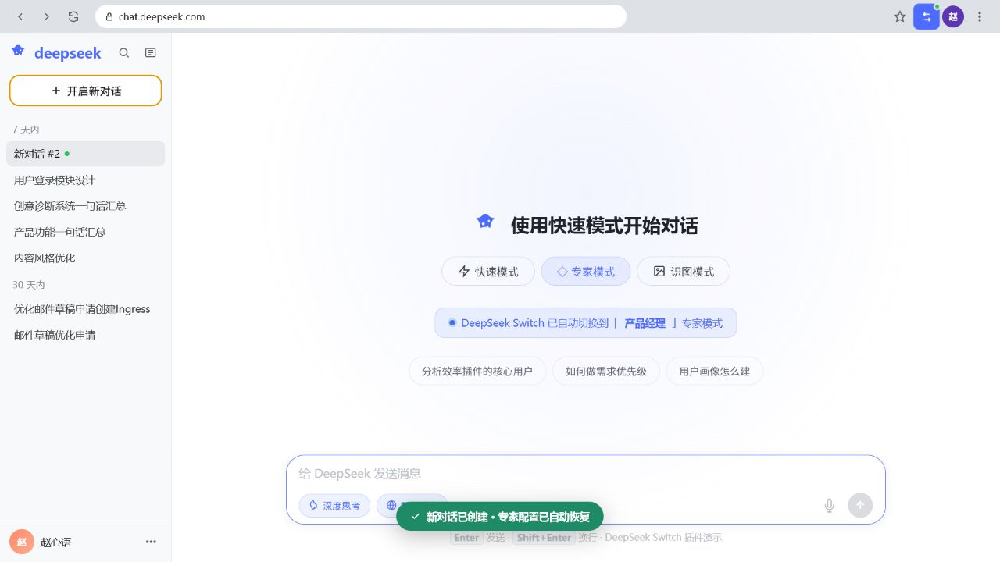

# DeepSeek Switch 完整使用手册

> 适用版本：v1.0.1　|　适用浏览器：Google Chrome　|　更新日期：2026-07-17

DeepSeek Switch 是一个 Chrome 扩展，用来在 DeepSeek 网页端自动选择“专家模式”，并把你预先设置的专家角色、回答语言、语气、详略程度和内容格式应用到新对话的第一条消息。

如果你第一次安装浏览器扩展，不用担心：从下载到完成第一次专家对话，通常只需要 3～5 分钟。

## 一、3 分钟快速上手

1. 下载并解压 [`deepseek-switch-v1.0.1.zip`](../dist/deepseek-switch-v1.0.1.zip)。
2. 在 Chrome 地址栏输入 `chrome://extensions/`，按回车。
3. 打开右上角“开发者模式”。
4. 点击“加载已解压的扩展程序”，选择解压后、直接包含 `manifest.json` 的文件夹。
5. 打开 [https://chat.deepseek.com/](https://chat.deepseek.com/)，刷新一次页面。
6. 点击 Chrome 工具栏中的 DeepSeek Switch 图标，选择专家身份和回答偏好。
7. 点击“开启新对话”，输入问题并发送。页面出现“DeepSeek Switch 已自动应用”时即表示成功。

## 二、安装前准备

你需要准备：

- 一台已经安装 Google Chrome 的电脑。
- 可以正常访问并登录 DeepSeek 网页版。
- 本扩展的 ZIP 压缩包，或本 GitHub 仓库的完整目录。

### 方法 A：使用 ZIP 安装（推荐新手）

1. 下载 [`dist/deepseek-switch-v1.0.1.zip`](../dist/deepseek-switch-v1.0.1.zip)。
2. 右键压缩包，选择“全部解压”或“解压到当前文件夹”。
3. 打开解压后的目录，确认里面能直接看到 `manifest.json`、`background.js`、`popup`、`content` 等内容。

> 重要：不要直接选择 ZIP 文件，也不要选择外层空目录。Chrome 要求选择“直接包含 `manifest.json` 的文件夹”。

### 方法 B：使用 Git 克隆

如果电脑已经安装 Git，可运行：

```bash
git clone https://github.com/AI-DIY/DeepSeek-Switch.git
```

加载扩展时选择克隆得到的 `DeepSeek-Switch` 仓库根目录。

## 三、在 Chrome 中安装扩展

在 Chrome 地址栏输入：

```text
chrome://extensions/
```

然后按下图顺序操作：



图中标号说明：

1. 打开右上角的“开发者模式”开关。
2. 点击左上角“加载已解压的扩展程序”。
3. 选择解压后的 `deepseek-switch` 文件夹；该文件夹中必须直接包含 `manifest.json`。

安装成功后，扩展列表中会出现 **DeepSeek Switch**，版本号为 **1.0.1**。

### 把扩展固定到工具栏

1. 点击 Chrome 右上角的拼图图标“扩展程序”。
2. 找到 DeepSeek Switch。
3. 点击右侧图钉，使图标固定在地址栏旁边。

如果工具栏图标上出现绿色 `ON`，表示自动专家模式已启用。

## 四、第一次使用

1. 打开 [DeepSeek 网页版](https://chat.deepseek.com/)。
2. 如果安装扩展前已经打开过 DeepSeek，请按 `Ctrl + R` 刷新页面。
3. 点击工具栏中的 DeepSeek Switch 图标。
4. 保持“自动专家模式”和“新对话自动应用”处于开启状态。
5. 选择专家角色和回答偏好。
6. 点击“开启新对话”。
7. 输入问题，按 `Enter` 或点击 DeepSeek 发送按钮。

新对话页面会显示专家模式已自动切换：



看到“DeepSeek Switch 已自动切换到……专家模式”或类似状态提示，说明扩展已经准备好。配置会在该对话的第一条消息发送前应用。

## 五、认识插件设置界面



界面从上到下分为以下区域：

| 区域 | 作用 | 新手建议 |
| --- | --- | --- |
| 自动专家模式 | 插件总开关；关闭后不再自动应用配置 | 保持开启 |
| 默认专家身份 | 选择长期使用的专家角色 | 不确定时选“编程专家”或与你任务最接近的角色 |
| 任务场景快选 | 一键切换常见场景和对应角色 | 临时换任务时最快 |
| 回答偏好 | 设置详略、格式、语言和语气 | 初次使用可保留默认值 |
| 自定义专业要求 | 补充行业背景、输出规范和禁用事项 | 有明确要求时再填写 |
| 新对话自动应用 | 每次新建对话时重新准备专家配置 | 建议开启 |
| 显示页面状态条 | 在 DeepSeek 页面显示当前角色和应用状态 | 建议开启，便于排查问题 |
| 应用到下一条 | 在当前会话中，让下一条消息重新使用配置 | 修改设置或切换角色后使用 |
| 开启新对话 | 直接创建 DeepSeek 新对话 | 最稳妥的开始方式 |
| 导出 / 导入 / 重置 | 备份、恢复或清空设置 | 更换电脑前先导出 |

所有设置都会自动保存到 `chrome.storage.sync`。正常使用时不需要寻找“保存”按钮。

## 六、如何选择专家角色

扩展内置 6 种专家身份：

| 专家角色 | 适合的任务 | 默认关注点 |
| --- | --- | --- |
| 编程专家 | 写代码、排错、架构设计、接口设计、数据库 | 可运行性、可维护性、安全、性能和边界条件 |
| 写作顾问 | 文案、邮件、文章、标题、改写和润色 | 受众、目的、语气、结构和多版本表达 |
| 学术导师 | 概念解释、论文思路、学习方法、研究设计 | 定义、例子、推导、事实与假设区分 |
| 产品经理 | 用户研究、需求分析、功能规划、优先级 | 目标用户、核心场景、商业约束和验证方法 |
| 翻译专家 | 中英翻译、术语统一、本地化 | 原意、语气、专业术语和目标读者 |
| 分析顾问 | 资料分析、决策比较、风险判断 | 核心判断、依据、假设、因果关系和反例 |

### “专家身份”和“场景快选”有什么区别？

- **专家身份**有 6 种，适合精确选择长期角色。
- **场景快选**有 4 种，用于快速切换常见任务。
- 点击场景快选时，会同时切换到该场景对应的专家角色。例如“产品分析”会选择“产品经理”。

## 七、设置回答偏好

### 1. 详略程度

| 选项 | 适合情况 |
| --- | --- |
| 精简结论 | 只想快速得到答案、摘要或决策结论 |
| 标准详略 | 日常使用，兼顾结论与必要说明 |
| 深入展开 | 学习、方案设计、复杂分析或需要完整推导 |

### 2. 内容格式

| 选项 | 输出特点 |
| --- | --- |
| 结构化分点 | 使用标题和项目符号，便于快速浏览 |
| 结论 + 步骤 | 先给结论，再给执行步骤，适合解决问题 |
| Markdown 文档 | 适合 README、说明书、技术文档和可复制内容 |
| 自然段文本 | 适合文章、邮件、说明和连贯叙述 |

### 3. 回答语言

- **简体中文**：默认选项，适合大多数中文用户。
- **中英双语**：适合语言学习、对外文档或术语核对。
- **English**：要求主要使用英文回答。

### 4. 表达语气

- **专业直接**：结论清楚、少铺垫，适合工作场景。
- **友好易懂**：减少术语，适合入门学习和面向大众的内容。
- **严谨审慎**：强调前提、证据、不确定性和风险。

### 5. 自定义专业要求

此处最多可填写 3000 个字符。留空时，扩展会使用所选专家的内置要求。

推荐按“背景 + 目标 + 输出格式 + 限制”填写，例如：

```text
背景：我是零基础用户。
目标：让我可以照着步骤独立完成。
输出：先给结论，再列编号步骤，每一步都给示例。
限制：不要省略风险提示，不确定的信息要明确标注。
```

配置示例：



图中选择了“产品分析”、深入展开、Markdown 文档、中英双语和严谨审慎，并补充了面向零基础用户的输出要求。

## 八、自动应用的完整流程

### 新对话中的正常流程

1. 打开 DeepSeek 新对话页，或点击插件中的“开启新对话”。
2. 插件尝试选择 DeepSeek 网页原生“专家模式”。
3. 页面状态显示“等待首条消息”或“正在切换专家模式”。
4. 你输入第一条问题并发送。
5. 插件把专家角色和回答偏好与问题组合后，交给 DeepSeek 原有发送流程。
6. 当前会话被标记为“已应用”，后续消息不会重复附加配置。

成功应用后，页面会出现类似下图的提示和专家回答：



图中可确认两点：

- 顶部提示显示“DeepSeek Switch 已自动应用”。
- 回答区域显示所选专家角色和“专家模式”标签。

### 为什么只应用一次？

专家配置只需要在一个会话的第一条消息中建立。后续每条消息都重复附加，会造成内容冗余并浪费上下文，因此扩展会记录“当前会话已应用”。

### 新建对话后会发生什么？

开启“新对话自动应用”后，每次新建对话都会恢复所选配置：



图中绿色提示“新对话已创建 · 专家配置已自动恢复”，表示下一条消息会使用当前专家设置。

## 九、在当前会话重新应用配置

以下情况建议使用“应用到下一条”：

- 在同一会话中更换了专家角色。
- 修改了语言、语气、详略程度、内容格式或自定义要求。
- 打开的是已有历史会话，而不是新对话。
- 页面状态显示“当前会话未应用”。
- 怀疑上一条消息没有正确套用配置。

操作方法：

1. 点击 Chrome 工具栏中的 DeepSeek Switch 图标。
2. 完成新的配置。
3. 点击“应用到下一条”。
4. 返回 DeepSeek，发送下一条消息。

也可以直接点击 DeepSeek 页面上的插件状态条，它同样会把配置安排到下一条消息。

> “应用到下一条”会在总开关关闭时自动重新启用专家模式。

## 十、页面状态条怎么读

开启“显示页面状态条”后，DeepSeek 页面会显示所选角色和状态。常见状态如下：

| 状态 | 含义 | 需要做什么 |
| --- | --- | --- |
| 正在切换 DeepSeek 专家模式 | 插件正在寻找并点击网页原生专家模式 | 等待片刻 |
| DeepSeek 专家模式已开启 · 等待首条消息 | 已准备完成 | 直接发送问题 |
| 将通过首条消息应用专家配置 | 网页原生模式暂时不可用，但角色提示仍会应用 | 可以继续发送；若效果异常请刷新 |
| 当前会话已应用 | 本会话已经使用过配置 | 正常继续对话 |
| 当前会话未应用 | 当前会话没有待应用配置 | 点击状态条或“应用到下一条” |
| 专家模式已暂停 | 总开关关闭 | 点击“启用”或打开弹窗总开关 |

状态条右侧的“暂停 / 启用”可以快速控制插件。点击状态主体会安排“应用到下一条”。

## 十一、导出、导入和重置设置

### 导出设置

1. 打开插件弹窗。
2. 点击底部“导出”。
3. Chrome 会下载一个类似 `deepseek-switch-2026-07-17.json` 的文件。

建议在更换电脑、重装浏览器或大幅修改配置前导出备份。

### 导入设置

1. 点击底部“导入”。
2. 选择之前导出的 JSON 文件。
3. 显示“设置已导入”后即完成。

如果显示“导入文件无效”，请确认文件没有被手工改坏，并且确实是 DeepSeek Switch 导出的 JSON。

### 恢复默认设置

1. 点击底部“重置”。
2. 在确认框中选择确定。

默认配置为：编程专家、标准详略、结论 + 步骤、简体中文、专业直接，并开启自动应用和页面状态条。

## 十二、更新和卸载

### 更新 ZIP 版本

1. 下载新版 ZIP 并解压。
2. 建议先通过“导出”备份设置。
3. 用新文件替换旧目录内容，或加载新的解压目录。
4. 打开 `chrome://extensions/`。
5. 点击 DeepSeek Switch 卡片上的刷新按钮。
6. 刷新已经打开的 DeepSeek 页面。

### 更新 Git 版本

在仓库目录执行：

```bash
git pull
```

然后在 `chrome://extensions/` 中重新加载扩展，并刷新 DeepSeek 页面。

### 卸载

1. 打开 `chrome://extensions/`。
2. 找到 DeepSeek Switch。
3. 点击“移除”。

卸载扩展不会删除你的 DeepSeek 对话，但浏览器中保存的插件配置可能随扩展数据一起被清除。

## 十三、权限与隐私

扩展只申请以下权限：

| 权限 | 用途 |
| --- | --- |
| `storage` | 保存并同步插件配置 |
| `activeTab` | 识别当前标签页，并向当前 DeepSeek 页面发送新对话或下一条应用指令 |
| `https://chat.deepseek.com/*` | 只在 DeepSeek 官方聊天页面运行内容脚本 |

隐私说明：

- 扩展没有独立后端服务器。
- 配置保存在 Chrome 本地/同步存储中。
- 用户输入只在 `chat.deepseek.com` 页面内与专家配置组合，并通过 DeepSeek 原有流程发送。
- 扩展不读取浏览历史。
- 扩展不申请剪贴板、通知、下载或任意网站访问权限。

## 十四、常见问题排查

### 1. 安装时看不到“加载已解压的扩展程序”

原因通常是没有打开“开发者模式”。请在 `chrome://extensions/` 右上角先开启开发者模式。

### 2. Chrome 提示“清单文件缺失或不可读取”

你选择错了目录。重新选择直接包含 `manifest.json` 的文件夹，不要选择 ZIP 文件或外层目录。

### 3. 插件安装了，但 DeepSeek 页面没有反应

依次检查：

1. 刷新 DeepSeek 页面。
2. 确认网址以 `https://chat.deepseek.com/` 开头。
3. 确认“自动专家模式”已开启。
4. 在 `chrome://extensions/` 中点击扩展卡片的刷新按钮。
5. 再刷新 DeepSeek 页面并开启新对话。

### 4. 弹窗显示“DeepSeek 页面刷新后即可生效”

说明当前标签页可能不是 DeepSeek，或者 DeepSeek 页面是在扩展安装前打开的。切换到 DeepSeek 标签页并刷新即可。

### 5. 新对话没有自动应用

检查“新对话自动应用”是否开启。若已关闭，自动应用不会因刷新而重新开启；可点击“应用到下一条”手动使用。

### 6. 已有历史会话没有自动应用

这是预期行为。扩展默认把自动配置用于新对话，避免意外改变已有会话。请点击“应用到下一条”。

### 7. 修改角色后，当前会话仍像旧角色

修改设置不会强制重写已经建立的会话。修改完成后点击“应用到下一条”，或直接开启新对话。

### 8. 按 Enter 没有发送

- `Enter` 用于发送。
- `Shift + Enter` 用于换行。
- 如果 DeepSeek 正在生成内容，请等待生成结束后再发送。

### 9. 页面状态显示“将通过首条消息应用专家配置”

这表示 DeepSeek 网页原生专家模式控件暂时未被识别，但插件仍会把角色和偏好应用到首条消息。可以先继续使用；如果回答明显不符合配置，请刷新页面后重试。

### 10. DeepSeek 改版后插件失效

DeepSeek 是持续更新的网页应用，页面结构变化可能影响输入框、发送按钮或专家模式控件的识别。请到项目的 [Issues](https://github.com/AI-DIY/DeepSeek-Switch/issues) 页面反馈，并提供：

- Chrome 版本。
- DeepSeek 页面网址。
- 复现步骤。
- 页面状态文字。
- 不包含敏感对话内容的截图。

## 十五、推荐配置示例

### 编程排错

```text
角色：编程专家
详略：深入展开
格式：结论 + 步骤
语气：严谨审慎
自定义要求：先定位根因，再给最小修复方案；代码必须可运行；列出安全和兼容性风险。
```

### 小白学习

```text
角色：学术导师
详略：标准详略
格式：结构化分点
语气：友好易懂
自定义要求：假设我没有基础；先用生活类比，再给准确定义和一个练习题。
```

### 产品需求分析

```text
角色：产品经理
详略：深入展开
格式：Markdown 文档
语气：专业直接
自定义要求：输出目标用户、核心场景、痛点、需求优先级、验证指标和下一步行动。
```

### 中英翻译

```text
角色：翻译专家
详略：精简结论
格式：自然段文本
语言：中英双语
自定义要求：保留专业术语；先给自然译文，再列出有歧义的词和选择理由。
```

## 十六、使用前最终检查清单

- [ ] 扩展已经在 `chrome://extensions/` 中成功加载。
- [ ] DeepSeek 页面已在安装或更新扩展后刷新。
- [ ] 自动专家模式已开启。
- [ ] 已选择合适的专家角色和回答偏好。
- [ ] 新对话自动应用已开启，或已点击“应用到下一条”。
- [ ] 页面显示等待首条消息、已自动切换或已应用状态。
- [ ] 第一条消息发送后，后续消息没有重复附加配置。

完成以上检查后，即可正常使用 DeepSeek Switch。
